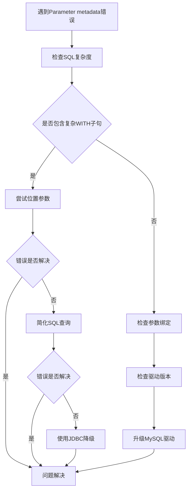

# Parameter Metadata 问题修复指南

## 🚨 错误现象
```
[Parameter metadata not available for the given statement]
```

## 🔍 问题原因分析

### 1. 主要原因
- **复杂SQL解析问题**：WITH子句、CTE等复杂查询让Hibernate无法正确解析参数元数据
- **命名参数解析冲突**：在复杂查询中，命名参数可能存在解析歧义
- **MySQL驱动版本限制**：某些版本的MySQL驱动对复杂查询的元数据解析有限制
- **Hibernate版本问题**：不同版本的Hibernate对原生SQL的支持程度不同

### 2. 触发条件
- 使用 `EntityManager.createNativeQuery()` 执行复杂原生SQL
- SQL包含大量WITH子句、子查询、窗口函数
- 使用命名参数 `:paramName` 而不是位置参数 `?`
- 参数在SQL中多次出现

## 🛠️ 解决方案

### 方案1：使用位置参数（推荐）✅

**问题**：命名参数在复杂SQL中解析困难
**解决**：使用位置参数 `?` 替代命名参数 `:paramName`

```java
// ❌ 问题代码
WHERE (:startTime IS NULL OR gd.send_out >= :startTime)

// ✅ 修复代码  
WHERE (? IS NULL OR gd.send_out >= ?)

// 参数设置
query.setParameter(1, startTime);  // 位置1：检查是否为null
query.setParameter(2, startTime);  // 位置2：实际值
```

**参数映射表**：
| 位置 | 参数名称 | 用途 | 示例值 |
|------|----------|------|--------|
| 1 | startTime check | null检查 | startTime |
| 2 | startTime value | 实际值 | startTime |
| 3 | endTime check | null检查 | endTime |
| 4 | endTime value | 实际值 | endTime |
| 5 | teamName check | null检查 | teamName |
| 6 | teamName value | 实际值 | teamName |
| 7 | dentistId check | null检查 | dentistId |
| 8 | dentistId value | 实际值 | dentistId |
| 9 | LIMIT | 分页大小 | 10 |
| 10 | OFFSET | 偏移量 | 0 |

### 方案2：SQL简化（备用方案）🔄

**问题**：复杂的WITH子句导致解析失败
**解决**：将复杂查询拆分为多个简单查询

```java
// ❌ 复杂的WITH查询
WITH ExpandedOrders AS (...), first_designs AS (...) ...

// ✅ 简化的直接查询
SELECT COALESCE(gt.name, '未分组') AS team_name,
       gd.name AS dentist_name, ...
FROM gms_dentist gd
LEFT JOIN gms_case gc ON gc.dentist_code = gd.code
```

### 方案3：JDBC降级处理（兜底方案）⚡

**问题**：Hibernate层面无法解决
**解决**：直接使用JDBC连接执行SQL

```java
Connection connection = entityManager.unwrap(Connection.class);
try (PreparedStatement ps = connection.prepareStatement(sql)) {
    ps.setObject(1, teamName);
    ps.setObject(2, teamName);
    // ...
    try (ResultSet rs = ps.executeQuery()) {
        // 处理结果集
    }
}
```

## 🔧 配置修复

### 1. MySQL驱动版本升级

```xml
<!-- pom.xml -->
<dependency>
    <groupId>mysql</groupId>
    <artifactId>mysql-connector-java</artifactId>
    <version>8.0.33</version>
</dependency>
```

### 2. Hibernate配置优化

```properties
# application.properties
spring.jpa.properties.hibernate.jdbc.lob.non_contextual_creation=true
spring.jpa.properties.hibernate.temp.use_jdbc_metadata_defaults=false
spring.jpa.properties.hibernate.dialect=org.hibernate.dialect.MySQL8Dialect
```

### 3. 数据源配置

```java
@Configuration
public class DataSourceConfig {
    
    @Bean
    @Primary
    public DataSource dataSource() {
        HikariDataSource dataSource = new HikariDataSource();
        dataSource.setJdbcUrl("jdbc:mysql://localhost:3306/db?useSSL=false&allowPublicKeyRetrieval=true&serverTimezone=UTC");
        dataSource.setDriverClassName("com.mysql.cj.jdbc.Driver");
        dataSource.addDataSourceProperty("useServerPrepStmts", "false"); // 关键配置
        dataSource.addDataSourceProperty("cachePrepStmts", "false");
        return dataSource;
    }
}
```

## 📝 代码实现示例

### 完整的修复实现

```java
@Service
@Transactional("dorisTransactionManager") 
public class DentistCommunicationReportServiceImpl implements ReportService {
    
    @PersistenceContext(unitName = "doris")
    private EntityManager entityManager;

    // 使用位置参数的SQL
    private static final String MAIN_QUERY = """
        WITH ExpandedOrders AS (...)
        WHERE (? IS NULL OR gd.send_out >= ?)
          AND (? IS NULL OR gd.send_out <= ?)
        ...
        AND (? IS NULL OR gms_team.name = ?)
        AND (? IS NULL OR gms_dentist.id = ?)
        LIMIT ? OFFSET ?
        """;

    @Override
    public PageImpl<DentistCommunicationReportVM> dentistCommunicationReport(
            DentistCommunicationReportQueryVM param) {
        
        try {
            // 方法1：位置参数查询
            return executeWithPositionalParams(param);
        } catch (Exception e) {
            log.warn("位置参数查询失败，尝试降级处理: {}", e.getMessage());
            
            try {
                // 方法2：简化SQL查询
                return executeWithSimplifiedSQL(param);
            } catch (Exception e2) {
                log.warn("简化SQL查询失败，使用JDBC查询: {}", e2.getMessage());
                
                // 方法3：JDBC降级查询
                return executeWithJDBC(param);
            }
        }
    }
    
    private PageImpl<DentistCommunicationReportVM> executeWithPositionalParams(
            DentistCommunicationReportQueryVM param) {
        
        Query query = entityManager.createNativeQuery(MAIN_QUERY);
        
        // 严格按照SQL中的参数顺序设置
        int paramIndex = 1;
        query.setParameter(paramIndex++, param.getStartTime());
        query.setParameter(paramIndex++, param.getStartTime());
        query.setParameter(paramIndex++, param.getEndTime());
        query.setParameter(paramIndex++, param.getEndTime());
        query.setParameter(paramIndex++, normalizeStringParam(param.getTeamName()));
        query.setParameter(paramIndex++, normalizeStringParam(param.getTeamName()));
        query.setParameter(paramIndex++, normalizeStringParam(param.getDentistId()));
        query.setParameter(paramIndex++, normalizeStringParam(param.getDentistId()));
        query.setParameter(paramIndex++, param.getPageSize());
        query.setParameter(paramIndex, param.getPageNumber() * param.getPageSize());
        
        List<Object[]> results = query.getResultList();
        // ... 处理结果
    }
}
```

## 🧪 测试验证

### 1. 参数顺序验证测试

```java
@Test
public void testParameterOrder() {
    // 验证参数顺序是否正确
    String sql = "SELECT * FROM table WHERE (? IS NULL OR col1 = ?) AND (? IS NULL OR col2 = ?)";
    
    // 参数应该按照出现顺序设置
    // 位置1: param1 的null检查
    // 位置2: param1 的实际值  
    // 位置3: param2 的null检查
    // 位置4: param2 的实际值
}
```

### 2. 边界情况测试

```java
@Test
public void testEdgeCases() {
    // 测试所有参数为null的情况
    DentistCommunicationReportQueryVM nullParams = DentistCommunicationReportQueryVM.builder()
        .pageNumber(0)
        .pageSize(10)
        .startTime(null)
        .endTime(null) 
        .teamName(null)
        .dentistId(null)
        .build();
        
    // 应该不抛出异常
    PageImpl<DentistCommunicationReportVM> result = service.dentistCommunicationReport(nullParams);
    assertNotNull(result);
}
```

## 🎯 最佳实践

### 1. 参数处理
- ✅ 使用位置参数而非命名参数
- ✅ 参数顺序与SQL中的占位符顺序严格一致  
- ✅ null值参数要特殊处理
- ✅ 字符串参数要标准化（去空格、空值转null）

### 2. SQL编写
- ✅ 避免过于复杂的WITH子句嵌套
- ✅ 减少参数在SQL中的重复出现
- ✅ 使用简单明了的表别名
- ✅ 分离数据查询和计数查询

### 3. 错误处理
- ✅ 实现多级降级处理
- ✅ 详细的错误日志记录
- ✅ 提供默认数据兜底
- ✅ 参数验证要全面

### 4. 性能优化
- ✅ 合理设置分页大小
- ✅ 避免深度分页（大OFFSET值）
- ✅ 对关键字段建立索引
- ✅ 监控慢查询

## 🔄 故障排除流程



## 📋 问题检查清单

- [ ] SQL是否包含复杂的WITH子句？
- [ ] 是否使用了命名参数 `:paramName`？
- [ ] 参数在SQL中是否多次出现？
- [ ] MySQL驱动版本是否过低？
- [ ] Hibernate配置是否正确？
- [ ] 参数设置顺序是否与SQL一致？
- [ ] null值参数是否正确处理？
- [ ] 是否有降级处理机制？

## 🎉 预期结果

修复后应该能够：
- ✅ 正常执行复杂SQL查询
- ✅ 支持所有参数为null的情况
- ✅ 正确进行LIMIT OFFSET分页
- ✅ 返回准确的查询结果
- ✅ 具备良好的错误处理能力

按照本指南的方案，**Parameter metadata not available** 问题应该能够得到有效解决。